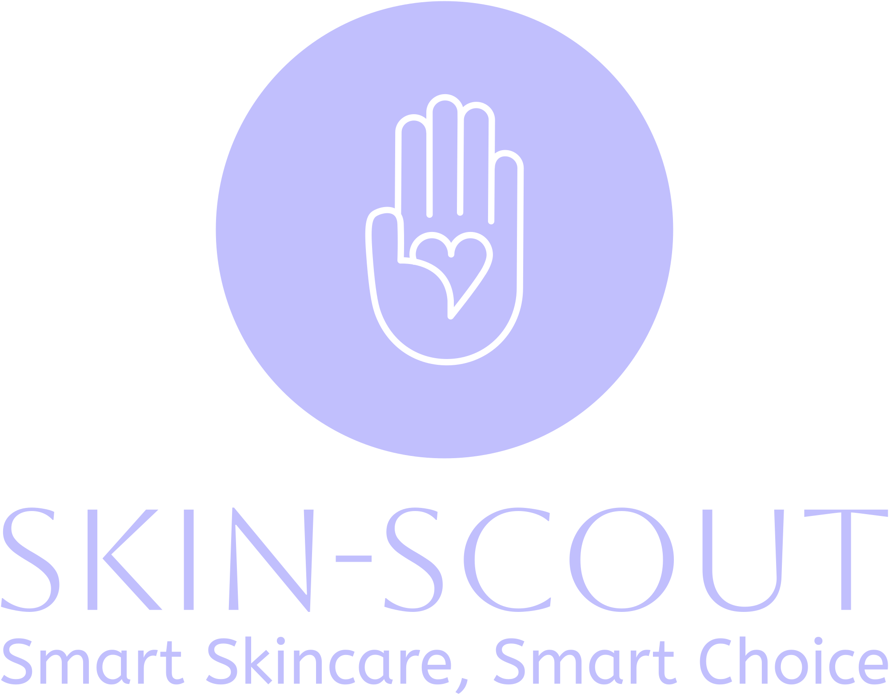

    <h1><b>Skin-Scout</b></h1>
    
      

---
# Skin-Scout - USER REVIEW ANALYSIS AND RECOMMENDER SYSTEM

This project will utilize Natural Language Processing (NLP) and recommender system in order to help predict whether a customer will recommend a product or not and also to give recommendation of similar skincare product

## Project Objective
The current skincare market is flooded with countless products each with unique ingredients and highlights. consumers often struggle to decide which product most consumer recommend due to the large amount of reviews for each different products, making reading to all the review traditionally wasting too much time and effort. While other metrics such as star rating is present on most skincare website, relying on only star rating to rate the quality of a product is unreliable. Due to this factor our teams goal is to create an application where we could make this process easier by finding out whether a certain user will recommend or not recommend a product based on their review

## Methods Used
* Natural Language Processing (NLP)
* Machine Learning
* Data Visualization
* cosine similarity

## Technologies
* Python
* PostGres SQL
* Pandas
* DAG Airflow
* Streamlit
* Hugging Face

## Project Description
The current skincare market is flooded with countless products each with unique ingredients and highlights. consumers often struggle to decide which product most consumer recommend due to the large amount of reviews for each different products, making reading to all the review traditionally wasting too much time and effort. While other metrics such as star rating is present on most skincare website, relying on only star rating to rate the quality of a product is unreliable as research has shown that star rating has many problem such as negativity bias where one negative aspect could lead to users leading a low star despite excelling in other area and also sometime the review and star a user give has discreptancy with some research finding only a moderate correlation between review and star rating. Hence, consumers are left to go through multiple reviews in order to get an accurate insight regarding certain skincare product. Due to this factor our teams goal is to create an application where we could make this process easier by finding out whether a certain user will recommend or not recommend a product based on their review. In order to test this we will use a dataset from sephora product review to create these model.

## Featured Links
* [Hugging Face](https://huggingface.co/spaces/celineclarissa/Skin-Scout)
* [Original Data](https://www.kaggle.com/datasets/teejmahal20/airline-passenger-satisfaction/data)

## Group Members:

|Name     |  Slack Handle   | 
|---------|-----------------|
|[Achmad Abdillah Ghifari](https://github.com/Gigis123)|    @Gigis123        |
|[Celine Clarissa](https://github.com/celineclarissa) |     @celineclarissa    |
|[Evan Juanto](https://github.com/juanto26) |     @juanto26   |
